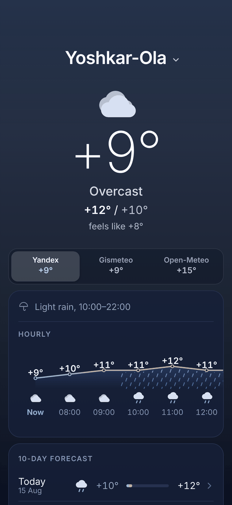
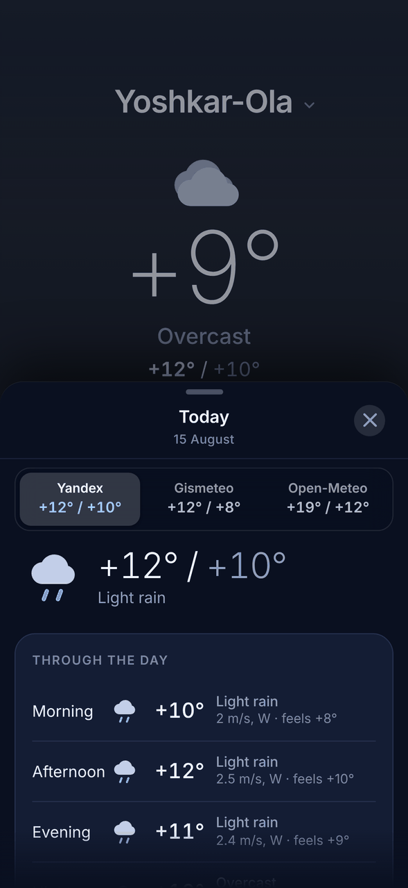

# CM Weather

[](https://github.com/mureev/weather/actions/workflows/ci.yml)

A self-hosted, ad-free weather app for an iPhone. The phone talks only to your
server; your server talks to the weather sites. No App Store, no Apple Developer
licence, and no upstream ever sees the phone's IP.

The owner directs; Claude Code builds — see [How this was built](#how-this-was-built).

Default city Yoshkar-Ola, text search for anywhere else, and a **Моё
местоположение** button when you want *here*. One instance runs on the owner's
server for his own phone: a personal tool, not a public service
([Legal](#legal) says why).

Three independent sources — **Яндекс**, **Gismeteo**, **Open-Meteo** — fetched
together and switchable with one tap.

<p align="center">
  
  &nbsp;
  
</p>
<p align="center"><sub>Rendered by <code>python -m tools.phone</code> from the recorded fixtures, at the iPhone's 393×852 view.</sub></p>

Compressed, the shell — page, script and service worker, with a stand-in
payload — measures about 49 kB, against a test that fails at 49,000 bytes; a
real cold load, all three sources answering, is about 54 kB. The process's
cache is bounded, and that is tested too. The image's 34 MB of dependencies is
a measurement recorded in `DECISIONS.md` §18, not a test.

```bash
make            # the everyday commands
make check      # lint + 581 tests, no network required
make run        # localhost:8080 against live upstreams
git push        # to master: tested, published, live in minutes
make status     # what is live: its build, then its own health verdict
```

---

## Start here

If you are picking this up cold, read these four things and skip the rest until
you need it:

1. **`make check` must pass before you believe anything.** 581 tests, no
   network. The parser tests run against real captured HTML, not invented
   markup.
2. **The fixtures in `tests/fixtures/` are ground truth.** When a site
   redesigns, `make fixtures` re-records from production and the test diff tells
   you exactly what moved. That two-minute loop is what this project is built
   around.
3. **`DECISIONS.md` holds the reasoning.** The code is cheap to regenerate; the
   reasoning is not. That is not a platitude here — this project's predecessor
   lost its entire codebase and was rebuilt in an afternoon from surviving
   documentation, and the *only* thing that mattered was the why.
4. **`/api/health` is the diagnostic.** Per source: available, why not,
   provenance tier per field, pairwise divergence, and the build SHA. It answers
   "what is wrong" without guessing.

---

## Architecture

```
iPhone PWA ──HTTPS──▶ mureev.com/weather ──┬─▶ yandex.ru/pogoda    RSC flight JSON
(same origin only)                         ├─▶ gismeteo.ru  ─┐    window.M.state
                                           │   meteofor.lv ─┘    (same data, two doors)
                                           └─▶ Open-Meteo         plain JSON API
                                            ▼
                           parse → validate → grade, per source
                    GET /api/weather → all three + a health block
```

All three are fetched concurrently and **all three are returned in one
payload**. Switching source is a client-side choice with no refetch — which
matters for a reason beyond latency: you are comparing three readings taken at
the same instant, not three taken as you tapped. Each tab carries its own
temperature, so the disagreement is visible without switching at all.

| source | current | hourly | 10-day | per-day detail | nowcast | any city? |
|---|---|---|---|---|---|---|
| Яндекс | RSC flight JSON | a11y prose, 24 h | a11y prose | 4 parts of day | ✓ | ✓ by lat/lon |
| Gismeteo | `window.M.state` | typed attrs, own page, ~25 h | typed attrs | 4 parts × 13 metrics | — | only known ids |
| Open-Meteo | JSON API | JSON API, ~240 h | JSON API | hourly, any day | — | ✓ by lat/lon |

The **per-day detail** column is what the day screen renders, and the three
entries in it are genuinely different kinds of thing rather than three
completions of the same table — see the front-end section below.

The front end has no idea *how* any number was extracted. That indirection is
the maintainability story: when a site redesigns — not if — one parser changes
and nothing downstream notices.

### Extraction: three tiers, three mechanisms

Not three flavours of CSS selector. Three things that fail *independently*:

| tier | mechanism | breaks when |
|---|---|---|
| 1 `NAMED` | embedded state JSON | the site changes its internal data contract |
| 2 `LABELLED` | accessibility prose, labelled neighbourhoods | the information architecture changes |
| 3 `SHAPE` | content-classified DOM cells | the CSS class names change |

Every field records which rung answered. If yesterday everything came from tier
1 and today it all comes from tier 3, the numbers may still be perfectly
correct, and the ground has moved, and the parser is one edit from confidently
reading the wrong cell. `health.sources.<x>.fallback_profile` says so on a calm
day rather than on the day you needed the forecast.

**Yandex** is a Next.js App Router app; its RSC flight stream carries a `fact`
object whose keys mirror the official API. Each day card also carries a
visually-hidden screen-reader paragraph that is *more precise than the screen*
(`1,7 м/с` where the visible cell rounds to `2`) and self-labelling, so the
whole "right shape, wrong cell" failure class cannot occur there.

**Gismeteo** is easier, contrary to both sites' reputations: `window.M.state` is
plain JSON carrying the city's own coordinates, so its identity check is
arithmetic rather than an argument about Russian declension, and its forecast
temperatures are `<temperature-value value="21">` — a typed, already-signed
attribute. It costs four requests rather than one: the landing page's hourly
strip is *three*-hourly, eight columns wide, so `/hourly/` is fetched as well
and whichever page yields more hours wins; `/10-days/` carries fifteen labelled
metric rows; and `/3-days/` — which is misnamed, and is really a ten-day grid at
four columns a day — carries those same rows per part of day. The last two of
those are optional by construction: if either redesigns, the forecast gets
coarser instead of disappearing.

Gismeteo is also the one source that has to be *reached* rather than merely
parsed: it returns 403 to this server's address and no header, transport or TLS
change touches it. The fix was not a proxy. `meteofor.lv` is the same service
under its export brand — same numeric city ids, same page, same values to the
minute — and it serves the addresses `gismeteo.ru` refuses. So `GISMETEO_HOSTS`
is a list, `GISMETEO_PROXY` is a list, the fetch walks the product of the two
until one answers, and it remembers which one did. `make routes` shows you that
walk from whatever machine you run it on. The full story, including why the
proxy instinct was backwards, is `DECISIONS.md` §7.

### How it knows a parser broke

The failure that hurts is not the loud one. A parser returning nothing is caught
by the first `if not data`. A parser returning **743** because a redesign moved
the pressure cell will tell you it is +743 degrees — or a plausible +55 after
some well-meaning clamp — and you will believe it.

**Values are dropped, never clamped.** Every rejection path sets the field to
`None`. Five layers, each catching what the others cannot:

1. **Range contracts** — Oymyakon's −67.7 °C clears them; 743 in a temperature
   field does not.
2. **Unit signatures** — a range check says *impossible*, a signature says
   *why*. The interesting case is humidity `0.81`, which passes 0–100 cleanly
   and only the signature sees is a fraction.
3. **Series structure** — 24 identical hourly values means a selector matched
   one node and the loop read it 24 times. An 8 °C hour-to-hour step is a row
   misalignment, not meteorology.
4. **Continuity** — the temperature did not move 20° since the fetch twenty
   minutes ago. The allowance grows with the gap, so a long outage never trips
   it; its job is the parser that broke *between* two fetches.
5. **Internal coherence** — does the source agree with *itself*? The four above
   are vertical: one value, one series. None of them can see a headline
   condition describing midnight beside an hourly column describing now, which
   is a real bug that shipped here. Every field was in range, in the right
   unit, in a well-formed series and continuous; they were individually perfect
   and jointly nonsense. Only holding two of them against each other shows it.

Plus **page identity**, which is separate and the most important of all: a page
that parses perfectly but describes the wrong city is rejected before a single
number is believed. See `DECISIONS.md` §2.

Degradation is graded, per source, independently:

```
a field fails a contract  -> drop that field, serve the rest, say so
the source is unusable    -> that tab is disabled, with the reason on it
every source is unusable  -> serve the last good payload, marked stale
nothing cached either     -> 503 with an honest error
```

There is no rung on which the app serves a number it does not believe.

---

## The front end

No framework, no build step, no dependencies. Three files.

**The sky is one gradient painted three times** — on the page, on the browser
canvas (what iOS fills the notch and the overscroll bounce with), and as two
invisible solid-colour strips at the viewport edges, which is the only thing
iOS 26 Safari will read when it tints the areas behind its own status bar and
toolbar. It ignores `theme-color` and samples a fixed element's
*background-color*, so a gradient is invisible to it (`DECISIONS.md` §14).

**The hero has no card** — it sits on an animated, condition-aware sky. That is
not decoration: a box with four lines in it reads as *empty*, whereas the same
four lines on a sky read as *calm*.

Eighteen conditions, each with its own motion, on two axes that are deliberately
kept apart. `SKY_OF` collapses them into **seven colours**, because a palette
wants to be coarse — drizzle and a downpour are the same shade of grey, and
pretending otherwise makes the app flicker between near-identical blues on every
refresh. `FX_OF` keeps all eighteen, because the **motion** is where the
difference lives: thin and slow through dense and fast, so how hard it is
raining is legible from across the room without focusing on a number. Clear days
get a sun glow, clear nights a star field, fog gets bands that breathe, and
overcast gets a flat tint whose only variable is brightness.

Three rules hold it in check, each learned the hard way and each recorded beside
the line it governs: **`transform` and `opacity` only** (a test reads every
`@keyframes` block and fails on a third property); **seamless by construction**,
since a pattern repeating every *P* pixels may only be translated by a multiple
of *P* (§30); and **out of the way of the text**, in a masked wrapper that holds
clear of the status-bar strip and fades before the cards (§29).

`prefers-reduced-motion` stops all of it and keeps the colour — stopped, not
stripped, because the still frame of each is a legitimate picture of the
weather.

The **night flag rides on the envelope**, not on any source: only `clear`,
`partly` and `cloudy` carry the hour inside their icon, so rain at midnight is
still spelled `rain` and its drops were being lit for noon. It is derived from
solar position like everything else here, never from "the hour looks late" —
this is Yoshkar-Ola, where June is light at eleven and December dark at four.

**Icons know what time it is.** Two of the three sources ship no day/night
information whatsoever, so the sun is computed from the coordinates and the
clock rather than read or guessed — see `DECISIONS.md` §13, and note that the
tests check it against Gismeteo's own published sunrise and sunset.

**Hourly is a curve**, not a row of numbers, with the label riding the line —
"is it getting warmer or colder" is the actual question, and a line answers it
before you read a figure. **Day rows have range bars** showing where each day's
low-to-high sits inside the whole period, so "is Thursday the cold one" needs no
arithmetic.

**Tapping a day opens a sheet**, and so does tapping the city name. One
navigation primitive, built on `history.pushState` — which is the point rather
than an implementation detail: in a standalone iOS PWA the edge-swipe-back
gesture is wired to browser history, so a sheet that is a history entry can be
dismissed by the system gesture with the system's own animation. A sheet that
is a CSS class cannot, and hand-rolling the sideways swipe makes it worse
rather than better, because the platform gesture cannot be switched off and the
app then navigates back twice (`DECISIONS.md` §22). The vertical drag between
the sheet's two heights is ours, since nothing in the system competes for it
(§26).

**The day screen changes shape with the source**, deliberately. Яндекс publishes
four named parts of a day; Gismeteo publishes parts too, plus fifteen metric
rows; Open-Meteo publishes an hour at a time for ten days and no summary at
all. One table with a row per field would be mostly blank on any tab, and a
blank cell reads as *missing data* rather than as "this source does not work
that way". So each tab leads with what its source fills — parts of day where
there are parts, then the hourly curve, then the metrics — and the screen is
keyed by **date**, never by row index, since the three do not agree on which
morning their ten days begin (`DECISIONS.md` §23).

**One request is spent when you open a day, and nothing depends on it.** Yandex
publishes a page per day — eight three-hourly columns with feels-like, gusts and
precipitation probability, richer than anything on the ten-day page — but ten
days would be ten requests against the one this app spends per source per city
per ten minutes. So `/api/day` fetches exactly the day you opened, caches it for
the usual ten minutes, and the screen renders from the payload it already has
before the answer arrives. There is deliberately no spinner: offline, or with
the fetch refused, the screen is exactly what it was without it.

**Everything about *where* lives on one sheet**, opened by tapping the city
name. Search, geolocation and saved cities are all answers to the same question,
so they belong in one place rather than three permanent strips.

### The iOS constraint that shapes all of it

**A PWA cannot refresh in the background. At all.** Background Sync, Periodic
Background Sync and Background Fetch are unsupported; silent push is prohibited
by design, and a service worker that takes a push without showing a notification
has its subscription revoked after three strikes.

That is not a limitation you engineer around, it is one you design *for*: render
the cached payload instantly, refetch on every return to the foreground, and put
the timestamp somewhere you cannot miss it. The app never pretends the number on
screen is newer than it is.

---

## Privacy, and the ways it leaks

A PWA's own `fetch()` comes from the device and exposes the phone's IP.
**iCloud Private Relay does not help** — Apple states it "guarantees that users
can't use the system to pretend to be from a different region" and maps each
egress IP to the device's actual city. It preserves exactly the signal you want
suppressed.

So everything goes through the server. The naive version of that still leaks,
in these specific ways, all closed here:

1. **Third-party subresources are direct connections** — CDN fonts, hosted JS,
   and worst of all map tiles, which hit the tile host with your IP *and* the
   tile coordinates. Closed by `Content-Security-Policy: default-src 'self'`
   with no host allowlist at all, and by the service worker returning 403 for
   any cross-origin request. **Tested at the network layer**: `test_ui.py`
   captures every request the page makes and asserts none leaves the origin.
2. **`preconnect` / `dns-prefetch` / `preload` open real connections** before
   any JS runs. There are none, deliberately, with a comment saying so.
3. **Header forwarding** — only coordinates go upstream. Never the phone's
   `Accept-Language`, `User-Agent`, `Referer` or timezone; `Europe/Moscow`
   versus anything else gives away region independently of IP. The reverse
   proxy in front of the deployed instance, configured outside this repo, also
   blanks `X-Forwarded-For` on the way *in*: a value that never arrives cannot
   end up in a log.
4. **Geolocation** — opt-in, on a button, never automatic. Coordinates rounded
   to 2 decimals (~1.1 km) on the device and again on the server. They go to
   *your* server, which asks Yandex by lat/lon and reads the city name back off
   the response, so no fourth-party geocoder ever sees them.

**What this does not do is hide the server.** It is in Latvia, so Yandex sees a
Latvian IP — you have moved the signal, not removed it. `check_identity` makes
the resulting wrong-city risk fail loudly rather than silently. See
`DECISIONS.md` §7 for the tunnel that would remove it properly.

The egress proxies are worth one note here, since they are the one place a
stranger's machine could enter the path: every upstream is HTTPS, so a proxy is
asked to `CONNECT` and then relays bytes it cannot read, with certificates
verified against the origin by us. A hostile hop can stall or drop the
connection. It cannot hand back a forged forecast.

---

## Working on it

Python 3.11 or newer. The app itself needs only `requirements.txt`; the suite
and the tools need four more packages and a browser:

```bash
python3 -m venv .venv && . .venv/bin/activate
pip install -r requirements.txt pytest ruff playwright pillow
python -m playwright install chromium   # the browser suite and tools.phone
```

Without Chromium the browser tests skip themselves: fine on a laptop, and the
reason CI refuses to accept a skip. To use a browser that is already installed,
point `CHROMIUM_PATH` at it.

```bash
make check                              # lint + everything
make run                                # Docker: live upstreams, native arch, fast start
make mock                               # offline, against the fixtures
YW_MOCK=winter   make mock              # negative temperatures, U+2212
YW_MOCK=degraded make mock              # a source down, tabs disabled
make shots                              # screenshots, light + dark
```

The `degraded` scenario is worth looking at with your eyes. If it does not look
obviously wrong at a glance, the design has failed.

### The maintenance loop

It will break, because you are parsing someone's HTML. The goal is not to
prevent that; it is that you find out immediately instead of believing a wrong
number.

```bash
export DEBUG_TOKEN=...                  # the one the server runs with
make fixtures                           # re-record from the VPS, then run tests
```

Tests passing against re-recorded HTML means the parser is still correct against
reality. Tests failing tells you exactly which assumption broke.

```bash
make routes                             # which way in to Gismeteo works from here
make routes ARGS='http://1.2.3.4:8080'  # ...and would this proxy help?
make fixtures-ya                        # re-record Yandex from this machine (no DEBUG_TOKEN needed)
make fixtures-gm                        # re-record Gismeteo from whichever host answers
make fixtures-day                       # re-record the one-day page /api/day reads
make selftest                           # per-source fetch/parse/identity breakdown
make probe                              # why is a source returning 403?
```

`make fixtures-day` records Yandex's `…/details/auto/10-day-weather/day-N`: one
day per URL, eight three-hourly columns, feels-like, gusts, visibility and road
state. It was recorded before anything parsed it, deliberately, because a parser
written against markup nobody has looked at is how this project produced its
worst bugs. `sources/yandex_day.py` reads it now, fetched only when you open a
day. Gismeteo's equivalent, `/3-days/`, comes with `make fixtures-gm`.

`make routes` answers for the machine it runs on, and that is the catch: a
route verified — or a fixture recorded — on a machine that is not blocked
proves nothing about the machine that is, and your laptop is not blocked. The
server's own answer is in `/api/health`, per source, with the reason when there
is one; `make status` prints it.

`tools/README.md` explains what each diagnostic answers.

### Two things that used to need remembering, and no longer do

**The service-worker cache version** is a hash of the shell files, substituted
when `/sw.js` is served. It was bumped by hand eight times in one afternoon;
the ninth is the one you forget, and the symptom — a redesign invisible to every
installed device but perfect in a fresh browser — is horrible to diagnose.

**The build SHA** is baked into the image and shown in `/api/version`,
`/api/health` and, quietly, in the footer; `make status` asks for it. "Is my
change actually deployed?" should not require squinting.

---

## Layout

```
app/
  main.py            FastAPI routes, CSP, static mount, BASE_PATH
  config.py          env-driven settings (frozen dataclass)
  version.py         build stamp + shell hash for the service worker
  cities.py          registry + EXTRA_CITIES — lat/lon, never geoid
  models.py          the wire format: SourceView, Health, the envelope
  http.py            the only place an outbound client is built
  routing.py         which door to knock on, and from where (Gismeteo)
  service.py         orchestration, per-source assembly, divergence
  validation.py      the five layers; decides what is servable
  extract.py         Yandex: flight stream, a11y prose, DOM shape, identity
  cache.py           TTL cache with stale-serving grace
  ru_text.py         Russian vocabulary, content-shaped extraction, icons
  sun.py             solar position: is it night here, at this hour?
  series.py          which hourly entry describes a given instant — one answer
  sources/
    yandex_html.py   fetcher; request hygiene, host fallback
    yandex_day.py    one day, deeper — fetched only when you open one
    gismeteo.py      id registry, M.state, typed attrs
    openmeteo.py     no key, no quota
    geocode.py       text city search
static/              index.html, app.js, sw.js, debug.js, icons — no build step
docs/                the two screenshots at the top of this page
tests/               581 tests: parsers, degradation, invariants, docs, API, browser
tools/               diagnostics (see tools/README.md)
```

Delivery: **[DEPLOY.md](DEPLOY.md)**. Reasoning: **[DECISIONS.md](DECISIONS.md)**.
The contract for whoever builds next: **[AGENTS.md](AGENTS.md)**.

## How this was built

The owner directs; Claude Code builds. Most commits carry a
`Co-Authored-By: Claude` trailer, and the arrangement shapes this repository
more than any framework could.

A session arrives knowing nothing and is gone within the hour, so nothing
important is allowed to live in anyone's memory. That is not a theory: this
project's predecessor lost its entire codebase and was rebuilt in an afternoon
from what had been written down. `AGENTS.md` is the contract every session
reads first; `DECISIONS.md` holds the why, and for each decision, what would
reverse it.

Whatever a machine can check is a test rather than a request: the import graph,
the rule that no parser reads the clock, the counts in this README. A rule kept
only in prose is one a well-meaning stranger will undo.

The builder never holds the phone, so the world is brought to it: real pages
recorded as fixtures, and an on-device diagnostic that turns "it looks wrong"
into numbers in one screenshot.

And a green push to `master` ships, behind a health-checked deploy that rolls
itself back — so a green tick had better mean what it says
(`DECISIONS.md` §33).

## Legal

The code is ours and MIT-licensed. The weather is not: every number on screen
belongs to the service it came from, and this app only fetches it.

`yandex.ru/robots.txt` permits `/pogoda`; `gismeteo.ru/robots.txt` permits
`/weather-*` and disallows every URL with a query string, which is why Gismeteo
is addressed only by its clean path form. We stay at human request rates — one
fetch per source per city per ten minutes, serving every device — and identify
as a normal browser. Both sites' general ToS presumably carry the usual
anti-automation clause, so this is a ToS question rather than a technical one;
for a single private reader on his own phone the exposure is negligible.

The deployed instance serves its owner, not the public. Anyone who runs one
publicly owes the services their terms: Yandex, its branding on publicly
displayed data — logo, «Данные Яндекс Погоды», a link back — and a real API key
used on its API terms; Open-Meteo, attribution, since its data is CC BY 4.0,
and its free tier is for non-commercial use only.

## Licence

Code, tests, tools and docs are MIT — see [LICENSE](LICENSE). The exception is
`tests/fixtures/`: trimmed captures of third-party pages, kept as test input
only. They are not ours, and we do not license them.
